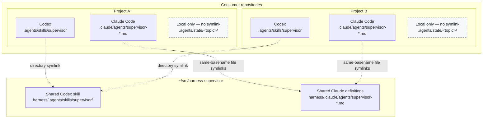

# harness-supervisor

A reusable supervision process for Codex and Claude Code. The repository keeps
one canonical skill, runtime-specific role routing, durable recovery state, and
Claude subagent definitions without sharing a consumer repository's live state
or settings.

## Layout

```text
harness/
  .agents/skills/supervisor/       shared process skill and references
  .claude/agents/supervisor-*.md   Claude Code role definitions
  AGENTS.supervisor.md             consumer instruction snippet
link.sh                            safe symlink installer
```

## How projects link to the harness



Each Claude link maps to the harness file with the same basename. The state
nodes deliberately have no arrows: every project owns its plans, WP checkpoints,
agent ledger, and recovery files locally.

The installer links only immutable shared assets. It creates
`.agents/state/` as a real local directory in every consumer. It does not link
or modify the consumer's `AGENTS.md`, `WORKLOG.md`, `.claude/settings.json`,
or any run-state file.

## Install in a repository

```sh
./link.sh /absolute/path/to/repository
```

The command is idempotent for links already owned by this checkout and refuses
to overwrite a real file, directory, or foreign link. For a repository that
already contains copied supervisor assets, review them, remove only those exact
copies, and run the installer again.

Merge the relevant text from `harness/AGENTS.supervisor.md` into the consumer's
own `AGENTS.md`; keep all project-specific rules beside it. Claude settings
remain local because hooks and permissions vary by repository.

The links are absolute so every consumer can live anywhere. If this checkout is
moved, rerun `link.sh` from its new location after removing the old broken
supervisor links.

## What is universal

- goal anchoring, diagnosis before planning, and root-owned design decisions;
- root-only versus delegated lane gates;
- local `.agents/state/<topic>/` plans, WP checkpoints, ledgers, and recovery;
- narrow briefs, file ownership, diff review, and evidence-based verification;
- exact current Codex and Claude model/effort routing;
- context rotation and cross-runtime recovery;
- isolated worktrees, English commits, and evidence-bearing commit bodies.

Consumer repositories still define their product boundaries, trace file,
available test layers, branch names, merge-request policy, and any stricter
safety rules.
