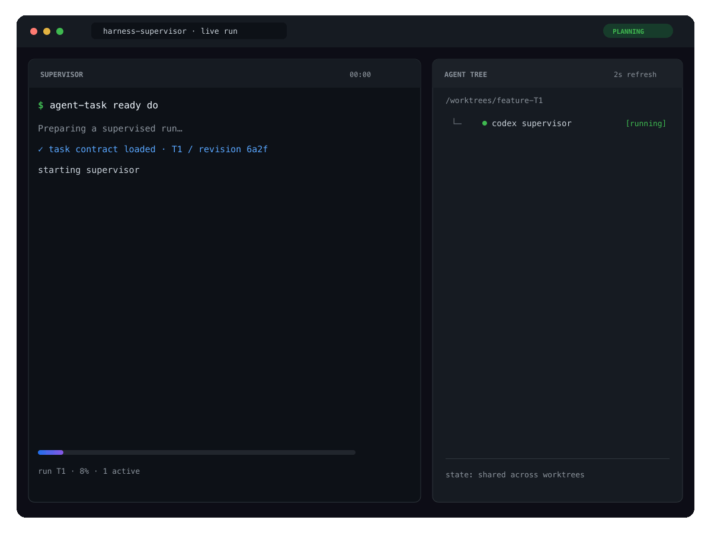

# harness-supervisor

Reliable coordination for Codex and Claude Code.

`harness-supervisor` gives an agent team a shared, Git-aware way to define work,
reserve local resources, retain verification evidence, and land a completed
change safely. It keeps durable decisions in Git and run-specific state local to
the checkout.



The supervisor turns one ready task into visible, verifiable parallel work — with
the live agent tree keeping every session in view.

Regenerate this documentation-only animation with
[`docs/generate-readme-demo.mjs`](docs/generate-readme-demo.mjs).

## What you get

| Need | Tool |
| --- | --- |
| A clear, reviewable task before execution | `agent-task` |
| One view of worktree state and safe handover | `agent-state` |
| Exclusive ports and other host resources | `agent-lease` |
| Evidence tied to exact task and Git revisions | `agent-verify` |
| Safe, serialized integration | `agent-merge-lock` |
| Installation and runtime diagnostics | `agent-doctor` |

## Install

From this checkout, link the harness into the repository you want to manage:

```sh
./link.sh /absolute/path/to/repository
./harness/bin/agent-doctor /absolute/path/to/repository --json
```

The installer is repeatable for links it owns, preserves an existing
`CLAUDE.md`, and refuses foreign paths. Add the relevant guidance from
[AGENTS.supervisor.md](harness/AGENTS.supervisor.md) to the target repository's
own `AGENTS.md`. If this checkout moves, inspect the diagnostic output and use:

```sh
./link.sh --relink-from /old/absolute/harness/checkout /absolute/path/to/repository
```

`agent-doctor` only reports what it finds. It never changes project or user
settings.

## Typical workflow

Create a task contract, review it, and give a fresh execution session its exact
revision:

```sh
agent-task stamp docs/tasks/feature.json
agent-task validate docs/tasks/feature.json
agent-task ready docs/tasks/feature.json planner 'The behavior and checks are settled.'
```

Work can proceed in an isolated worktree. Use `agent-state link` to make its
local run state visible from the main checkout, and use `agent-lease` for a
shared port or another exclusive resource:

```sh
agent-state link --topic T1
agent-lease port -- npm run dev
agent-state list --json
```

When the change is ready, record checks against the exact task and base, then
land it through the integration lock:

```sh
agent-verify record --base main --task-id T1 --task-revision REV --check 'npm test'
agent-merge-lock land --branch feature --base BASE_SHA --evidence EVIDENCE_FILE --task-id T1 --task-revision REV
```

`verified` means that exact artifact passed its recorded checks. `landed` means
it was integrated. A changed source, base, or task revision invalidates earlier
evidence.

## Codex and Claude Code

Use a strong planning session to settle the task contract, then start a fresh
Terra or Sonnet execution session with the ready task revision. A simple,
isolated task can run directly; add a coordinator or independent verifier only
when the work or its risk needs one. The full setup and handoff instructions are
in [runtime-handoff.md](docs/runtime-handoff.md).

## Development

Node.js 20 or later is required. No dependency install is needed.

```sh
npm test
npm run check
```

Read [task-contract.md](docs/task-contract.md) for the task format and review
rules.

## Live agent tree

After `link.sh` completes, run this from any worktree of the target repository:

```sh
.bin/agent-tree
```

The display refreshes every two seconds; stop it with `Ctrl-C`. Use `--codex`
or `--claude-code` to filter, and `--json` for one machine-readable snapshot.
See [monitor details](docs/agent-tree-plan.md).
